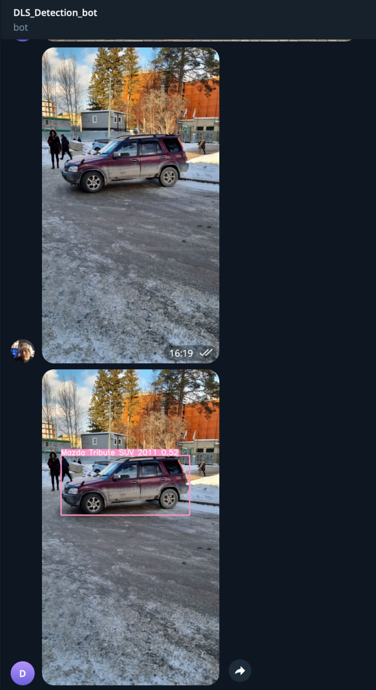
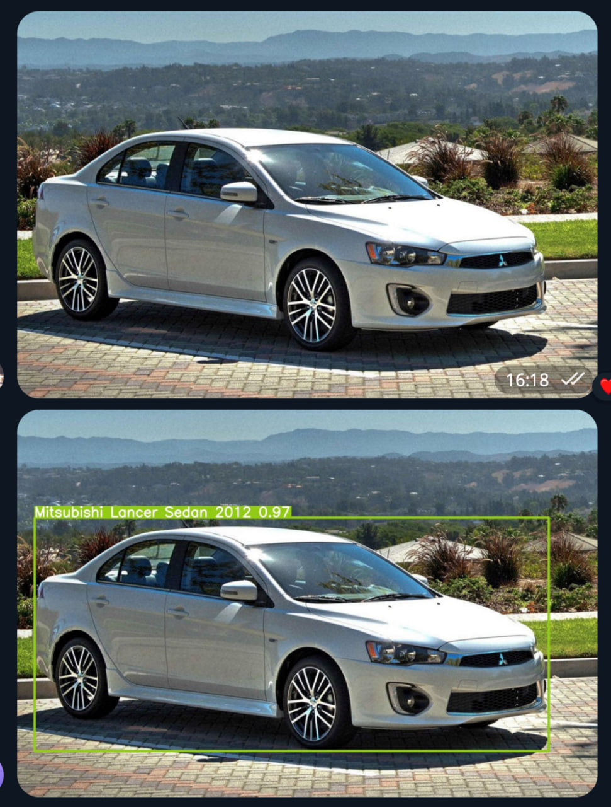

# Создание виртуальной среды
`python -m venv venv`

# Активация среды
`. venv/bin/acvivate`

# Установка зависимостей
`pip install -r requirements.txt`

# Установка датасета смотреть и все подробности смотреть в `notebook.ipynb` и `Копия_блокнота__[project]object_detection_spring_2023_ipynb_.ipynb`

# Запуск телеграм бота
`python bot.py`

# У телеграм бота есть 3 базовых функции
- `/start`
- `/help`
- `Отправка фото для распознавания и получение размеченного фото`

# Demo

